# 设计模式

# 设计模式

创建型模式：单例模式，工厂方法模式，抽象工厂模式，建造者模式，原型模式

结构型模式：适配器模式，代理模式，桥接模式，装饰器模式，外观模式，组合模式，享元模式

行为型模式：观察者模式，策略模式，命令模式，中介者模式，备忘录模式，模板方法模式，迭代器模式，状态模式，责任链模式，解释器模式，访问者模式


## UML

类图分三层

&gt; 第一层显示类的名称，如果是抽象类，则就用斜体显示。
&gt;
&gt; 第二层是类的特性，通常就是字段和属性。
&gt;
&gt; 第三层是类的操作，通常是方法或行为。
&gt;
&gt; 注意前面的符号，‘&#43;’表示public，‘-’表示private，‘#’表示protected

继承(Inheritance)关系用`空心三角形&#43;实线`来表示。

实现(Realization)接口用`空心三角形&#43;虚线`来表示。

关联(Association)关系用`实线箭头`来表示。

依赖(Dependency)关系用`虚线箭头`来表示。

聚合(Aggregation)表示一种弱的‘拥有’关系，体现的是A对象可以包含B对象，但B对象不是A对象的一部分。聚合关系用`空心的菱形&#43;实线箭头`来表示 。（汽车发动机是汽车的组成部分）

```mermaid
classDiagram
Car o--&gt; Engine : contains
```


组合(Composition)是一种强的‘拥有’关系，体现了严格的部分和整体的关系，部分和整体的生命周期一样。合成关系用`实心的菱形&#43;实线箭头`来表示。(嘴巴是头的组成部分)

```mermaid
classDiagram
Head *--&gt; Mouth : has
```
## 设计原则

### 单一职责原则

一个类只承担一个职责

### 开放封闭原则

对扩展开放，对修改封闭。

指的是软件在适应需求变化时，应尽量通过**扩展代码来实现变化，而不是通过修改已有代码**来实现变化。

* 使用枚举和 if-else 实现多态，难以扩展，还要一直去修改原函数的底层实现，就违背了**开闭原则**。

应尽量通过**扩展代码来实现变化，而不是通过\*修改已有代码**来实现变化。

### 依赖倒置原则

一个封装好的函数或类，应该尽量依赖于抽象接口，而不是依赖于具体实现

- 面向过程编程范式中，**函数指针**就是那个抽象接口。
- 面向对象编程范式中，**虚函数**就是那个抽象接口。
- 函数式编程范式中，**函数对象**就是那个抽象接口。
- 模板元编程范式中，**模板参数**就是那个抽象接口。

### 接口隔离原则

### 里氏替换原则

### 迪米特法则(最少知识原则)


## 创建型模式

### 单例模式

⼀个类只有⼀个实例，并提供⼀个全局访问点来访问这个实例。（对象创建型）

#### 单例设计模式优点

&gt; 全局控制：保证只有⼀个实例，这样就可以严格的控制客户怎样访问它以及何时访问它，简单的说就是对唯⼀实例的受控访问
&gt;
&gt; 节省资源：避免多次创建了相同的对象，节省系统资源，多个模块可以通过单例实例共享数据。
&gt;
&gt; 懒加载：单例模式可以实现懒加载，只有在需要时才实例化。

#### 基本要求



```mermaid
classDiagram
    class Singleton{
        -instance:Singleton
        -Singleton()
        &#43;GetInstance()
    }
```

&gt; 私有的构造函数：防止外部代码直接创建类的实例
&gt;
&gt; 私有的静态实例变量：保存该类的唯⼀实例
&gt;
&gt; 公有的静态方法：通过公有的静态方法来获取类的实例

#### 单例设计模式实现

```cpp
// c&#43;&#43;11后是线程安全的 （
class Singleton {
private:
    Singleton(){}
    Singleton(const Singleton&amp;) = delete;
    Singleton&amp; operator=(const Singleton&amp;) = delete;
public:
    static Singleton&amp; GetInstance() {
        static Singleton singleton;
        return singleton;
    }
};
```

##### 饿汉式

&gt; 类加载时完成实例创建

```cpp
// 饿汉式
class Singlehungry {
private:
    Singlehungry(){}
    Singlehungry(const Singlehungry&amp;) = delete;
    Singlehungry&amp; operator=(const Singlehungry&amp;) = delete;
public:
    static Singlehungry* GetInstance() {
        if (singleton == nullptr) {
            singleton = new Singlehungry();
        }
        return singleton;
    }
private:
    static Singlehungry* singleton;
};
// 饿汉式初始化
Singlehungry* Singlehungry::singleton = Singlehungry::GetInstance();
```

##### 懒汉式

&gt; 请求实例时才创建：线程不安全，需要加锁，防止资源被重复初始化

```cpp
// 懒汉式
class SingleLazy {
private:
    SingleLazy(){}
    SingleLazy(const SingleLazy&amp;) = delete;
    SingleLazy&amp; operator=(const Singlehungry&amp;) = delete;
public:
    static SingleLazy* GetInstance() {
        if(singleton != nullptr) {
            return singleton;
        }
        _mutex.lock();
        if (singleton != nullptr) {
            _mutex.unlock();
            return singleton;
        }
        singleton = new SingleLazy();
        _mutex.unlock();
        return singleton;
        
    }
private:
    static SingleLazy* singleton;
    static std::mutex _mutex;
};

SingleLazy* SingleLazy::singleton = nullptr;
std::mutex SingleLazy::_mutex;

// 懒汉式 智能指针 自动回收
class SingleAuto {
private:
    SingleAuto(){}
    SingleAuto(const SingleAuto&amp;) = delete;
    SingleAuto&amp; operator=(const SingleAuto&amp;) = delete;
public:
    ~SingleAuto() {std::cout &lt;&lt; &#34;single auto delete success &#34; &lt;&lt; std::endl; }
    static std::shared_ptr&lt;SingleAuto&gt; GetInstance() {
        if(singleton != nullptr) {
            return singleton;
        }
        _mutex.lock();
        if (singleton != nullptr) {
            _mutex.unlock();
            return singleton;
        }
        singleton = std::shared_ptr&lt;SingleAuto&gt;(new SingleAuto);
        _mutex.unlock();
        return singleton;
        
    }
private:
    static std::shared_ptr&lt;SingleAuto&gt; singleton;
    static std::mutex _mutex;
};

std::shared_ptr&lt;SingleAuto&gt; SingleAuto::singleton = nullptr;
std::mutex SingleAuto::_mutex;
// 定义友元类帮忙回收
class SingleAutoSafe;
class SafeDeletor {
public:
	void operator()(SingleAutoSafe* sf) {
		std::cout &lt;&lt; &#34;this is safe deleter operator()&#34; &lt;&lt; std::endl;
		delete sf;
	}
};
class SingleAutoSafe {
private:
    SingleAutoSafe(){}
    SingleAutoSafe(const SingleAutoSafe&amp;) = delete;
    SingleAutoSafe&amp; operator=(const SingleAutoSafe&amp;) = delete;
    ~SingleAutoSafe() {std::cout &lt;&lt; &#34;single auto delete success &#34; &lt;&lt; std::endl; }
    friend class SafeDeletor;
public:
    static std::shared_ptr&lt;SingleAutoSafe&gt; GetInstance() {
        if(singleton != nullptr) {
            return singleton;
        }
        _mutex.lock();
        if (singleton != nullptr) {
            _mutex.unlock();
            return singleton;
        }
        singleton = std::shared_ptr&lt;SingleAutoSafe&gt;(new SingleAutoSafe, SafeDeletor());
        _mutex.unlock();
        return singleton;
        
    }
private:
    static std::shared_ptr&lt;SingleAutoSafe&gt; singleton;
    static std::mutex _mutex;
};

std::shared_ptr&lt;SingleAutoSafe&gt; SingleAutoSafe::singleton = nullptr;
std::mutex SingleAutoSafe::_mutex;
```

##### call_once

&gt; `call_once`函数，配合一个局部的静态变量`once_flag`实现线程安全的初始化
&gt;
&gt; 多线程调用`call_once`函数时，会判断`once_flag`是否被初始化，如没被初始化则进入初始化流程，但是同一时刻只有一个线程能进入这个初始化函数

```cpp
class SingleOnce {
private:
    SingleOnce() = default;
    SingleOnce(const SingleOnce&amp;) = delete;
    SingleOnce&amp; operator=(const SingleOnce&amp;) = delete;
public:
    static std::shared_ptr&lt;SingleOnce&gt; GetInstance() {
        static std::once_flag _flag;
        std::call_once(_flag, [&amp;](){
            singleton = std::shared_ptr&lt;SingleOnce&gt;(new SingleOnce);
        });
        return singleton;
    }
    ~SingleOnce() {std::cout &lt;&lt; &#34;this is singleton destruct&#34; &lt;&lt; std::endl;}
private:
    static std::shared_ptr&lt;SingleOnce&gt; singleton;
};

std::shared_ptr&lt;SingleOnce&gt; SingleOnce::singleton = nullptr;

// 通用模板类
template &lt;typename T&gt;
class Singleton {
protected:
	Singleton() = default;
	Singleton(const Singleton&lt;T&gt;&amp;) = delete;
	Singleton&amp; operator=(const Singleton&lt;T&gt;&amp; st) = delete;
public:
	static std::shared_ptr&lt;T&gt; GetInstance() {
		static std::once_flag _flag;
		std::call_once(_flag, [&amp;]() {
			_instance = std::shared_ptr&lt;T&gt;(new T);
			});
		return _instance;
	}
	void PrintAddress() {
		std::cout &lt;&lt; _instance.get() &lt;&lt; std::endl;
	}
	~Singleton() {std::cout &lt;&lt; &#34;this is singleton destruct&#34; &lt;&lt; std::endl;}
private:
    static std::shared_ptr&lt;T&gt; _instance;
};
template &lt;typename T&gt;
std::shared_ptr&lt;T&gt; Singleton&lt;T&gt;::_instance = nullptr;
```

#### 单例模式的使用场景

* 资源共享：多个模块共享某个资源时，比如程序需要⼀个全局的配置管理器来存储和管理配置信息、管理数据库连接池。
* 只有⼀个实例：比如说管理应用程序中的缓存，确保只有⼀个缓存实例，避免重复的缓存创建和管理，或者创建和管理线程池。
* 懒加载：如果对象创建本身就比较消耗资源，而且可能在整个程序中都不⼀定会使用。

### 工厂方法模式

定义一个用于创建对象的接口，让子类决定将哪一个类实例化。工厂方法模式让一个类的实例化延迟到其子类。（类创建型）

#### 简单工厂模式

&gt; 定义一个工厂类，可以根据参数不同返回不同类的实例，被创建的实例通常都具有共同的父类。（静态工厂方法，类创建型））
&gt;
&gt; 优点：实现了对象创建和使用的分离；
&gt;
&gt; 缺点：工厂类集中所有产品创建逻辑，职责过重；增加系统中类的个数；拓展困难；静态工厂方法无法形成基于继承的等级结构。
&gt;

```mermaid
classDiagram
    class Product
    class ConcreteProductA
    class ConcreteProductB
    class Factory{
        &#43;factoryMethod(String arg) Product
    }
    Product&lt;|--ConcreteProductA: Inheritance
    Product&lt;|--ConcreteProductB: Inheritance
    ConcreteProductA&lt;..Factory : Dependency
    ConcreteProductB&lt;..Factory : Dependency

```

&gt; 工厂：负责实现创建所有产品实例看i的内部逻辑，提供静态工厂方法，返回抽象产品类型
&gt;
&gt; 抽象产品：工厂类创建的所有对象的父类，封装各种产品对象的公有方法。
&gt;
&gt; 具体产品：具体产品类，继承抽象产品。

#### 工厂方法模式优点

&gt; 优点：工厂方法用来创建客户所需要的产品，同时还向客户隐藏了哪种具体产品类将被实例化这一细节；基于工厂角色和产品角色的多态性设计；在系统中加入新产品，只要添加一个具体工厂和具体产品（开闭原则）。
&gt;
&gt; 缺点：添加新产品时需要编写新的具体产品类和对应的具体工厂类，系统中类的个数将成对增加。
&gt;
&gt; 优化：使用反射机制：根据类名字符串生成对象；引入配置文件

#### 基本要求

```mermaid
classDiagram
	class Factory{
        &#43;factoryMethod() Product
    }
    class ConcreteFactory{
        &#43;factoryMethod() Product
    }
    class ConcreteProduct
    class Product
    Factory &lt;|..ConcreteFactory : Realization
    ConcreteFactory..&gt;ConcreteProduct : Dependency
    Product&lt;|..ConcreteProduct : Realization
```

&gt; 抽象工厂：声明工厂方法，用于返回一个产品
&gt;
&gt; 具体工厂：抽象工厂子类，实现抽象工厂定义的工厂方法，创建具体产品实例。
&gt;
&gt; 抽象产品：定义产品的接口。
&gt;
&gt; 具体产品：实现抽象产品接口，是具体工厂创建的对象。

#### 工厂方法模式实现

```cpp
class ImageReader {
public:
    virtual void readImage(const std::string&amp; filepath) = 0;
    virtual ~ImageReader(){}
};

class GIFReader: public ImageReader {
public:
    void readImage(const std::string&amp; filepath) override {
        std::cout &lt;&lt; &#34;Reading GIF image from file: &#34; &lt;&lt; filepath &lt;&lt; std::endl;
    }
};

class JPGReader: public ImageReader {
public:
    void readImage(const std::string&amp; filepath) override {
        std::cout &lt;&lt; &#34;Reading JPG image from file: &#34; &lt;&lt; filepath &lt;&lt; std::endl;
    }
};

class ImageReaderFactory {
public:
    virtual ImageReader* createReader() = 0;
    virtual ~ImageReaderFactory(){}
};

class GIFReaderFactory: public ImageReaderFactory {
public:
    ImageReader* createReader() override {
        return new GIFReader();
    }
};

class JPGReaderFactory: public ImageReaderFactory {
public:
    ImageReader* createReader() override {
        return new JPGReader();
    }
};
```

#### 工厂方法模式使用场景

* 客户端不知道其所需要的对象的类，只需要知道所对应的工厂即可，具体的产品对象由具体工厂类创建，可将具体工厂类的类名存储在配置文件或数据库中。
* 抽象工厂类通过其子类来指定创建哪个对象。
* 具体工厂类在实现工厂方法时除了创建具体产品对象之外，还可以负责产品对象的初始化工作以及一些资源和环境配置工作，例如连接数据库、创建文件等

### 抽象工厂模式

提供一个创建一系列相关或相互依赖对象的接口，而无须指定它们具体的类。（对象创建型）

&gt; 工厂方法模式通过引入工厂等级结构，解决了简单工厂模式中工厂类职责太重的问题。
&gt;
&gt; 抽象工厂模式通过将一些相关的产品组成一个“产品族”，由同一个工厂来统一生产，解决工厂方法模式中每个具体工厂只负责创建单一产品，存在大量工厂类的问题。

#### 抽象工厂模式优点

&gt; 优点：方便增加产品族；隔离了具体类的生成
&gt;
&gt; 缺点：增加新的产品等级结构麻烦

#### 基本要求

```mermaid
classDiagram
	class Client
	class AbstractFactory {
		&#43;createPeoductA() AbstractProductA
		&#43;createPeoductB() AbstractProductB
	}
	class AbstractProductA
	class ConcreteProductA1
	class ConcreteProductA2
	class AbstractProductB
	class ConcreteProductB1
	class ConcreteProductB2
	class ConcreateFactory1 {
		&#43;createPeoductA() AbstractProductA
		&#43;createPeoductB() AbstractProductB
	}
	class ConcreateFactory2 {
		&#43;createPeoductA() AbstractProductA
		&#43;createPeoductB() AbstractProductB
	}
	Client..&gt;AbstractFactory : Dependency
	Client..&gt;AbstractProductA : Dependency
	Client..&gt;AbstractProductB : Dependency
	AbstractFactory&lt;|..ConcreateFactory1 : Realization
	AbstractFactory&lt;|..ConcreateFactory2 : Realization
	AbstractProductA&lt;|..ConcreteProductA1 : Realization
	AbstractProductA&lt;|..ConcreteProductA2 : Realization
	ConcreteProductA1&lt;..ConcreateFactory1 : Dependency
	ConcreateFactory1..&gt;ConcreteProductB1: Dependency
	ConcreteProductA2&lt;..ConcreateFactory2 : Dependency
	ConcreateFactory2..&gt;ConcreteProductB2 : Dependency
	AbstractProductB&lt;|..ConcreteProductB1 : Realization
	AbstractProductB&lt;|..ConcreteProductB2 : Realization
```

&gt; 抽象工厂：声明一组用于创建一族产品的方法，每个方法对应一种产品。
&gt;
&gt; 具体工厂：实现抽象工厂声明的方法。
&gt;
&gt; 抽象产品：定义产品的接口。
&gt;
&gt; 具体产品：实现抽象产品接口，是具体工厂创建的对象。

#### 抽象工厂模式实现

```cpp
// 操作控制类：抽象产品类A
class OperationController {
public:
    virtual void controlGame() = 0;
    virtual ~OperationController(){}
};

// 界面控制类：抽象产品类B
class InterfaceController {
public:
    virtual void displayInterface() = 0;
};

// 具体产品类A1
class iOSOperationController : public OperationController {
public:
    void controlGame() override {
        std::cout &lt;&lt; &#34;ios control game&#34; &lt;&lt; std::endl;
    }
};

// 具体产品类A2
class AndroidOperationController : public OperationController {
public:
    void controlGame() override {
        std::cout &lt;&lt; &#34;android control game&#34; &lt;&lt; std::endl;
    }
};

// 具体产品类B1
class iOSInterfaceController : public InterfaceController {
public:
    void displayInterface() override {
        std::cout &lt;&lt; &#34;ios display&#34; &lt;&lt; std::endl;
    }
};

// 具体产品类B2
class AndroidInterfaceController : public InterfaceController {
public:
    void displayInterface() override {
        std::cout &lt;&lt; &#34;android display&#34; &lt;&lt; std::endl;
    }
};

// 抽象工厂类
class AbstractFactory {
public:
    virtual OperationController* createOperationController() = 0;
    virtual InterfaceController* createInterfaceController() = 0;
    virtual ~AbstractFactory() {}
};

// iOS工厂 ：具体工厂1
class iOSFactory : public AbstractFactory {
public:
    OperationController* createOperationController() override {
        return new iOSOperationController();
    }
    InterfaceController* createInterfaceController() override {
        return new iOSInterfaceController();
    }
};

// Android工厂 ：具体工厂2
class AndroidFactory : public AbstractFactory {
public:
    OperationController* createOperationController() override {
        return new AndroidOperationController();
    }
    InterfaceController* createInterfaceController() override {
        return new AndroidInterfaceController();
    }
};
```

#### 抽象工厂模式使用场景

* 使⽤抽象⼯⼚模式来创建与不同数据库的连接对象

### 建造者模式

将一个复杂对象的构建与它的表示分离，使得同样的构建过程可以创建不同的表示。（对象创建型）

#### 建造者模式优点

&gt; 优点：客户端与包含多个部件的复杂对象的创建过程分离
&gt;
&gt; 缺点：建造者模式所创建的产品一般具有较多的共同点，其组成部分相似

#### 基本要求

```mermaid
classDiagram
	class Director {
		-builder: Builder
		&#43;construct()
	}
	class Builder {
		&#43;buildPartA()
		&#43;buildPartB()
		&#43;buildPartC()
		&#43;getResult()
	}
	class ConcreteBuilder {
		&#43;buildPartA()
		&#43;buildPartB()
		&#43;buildPartC()
		&#43;getResult()
	}
	class Product
	Director o--&gt; Builder : Aggregation
	Builder &lt;|-- ConcreteBuilder : Inheritance
	ConcreteBuilder..&gt;Product : Dependency

```

&gt; 抽象建造者：创建一个产品Product对象的各个部件指定抽象接口。一般声明两类方法：一类方法是buildPartX()，用于创建复杂对象的各个部件；另一类方法是getResult()，用于返回复杂对象
&gt;
&gt; 具体建造者：实现了Builder接口，实现各个部件的具体构造和装配方法，定义并明确其所创建的复杂对象
&gt;
&gt; 产品角色：被构建的复杂对象，包含多个组成部件
&gt;
&gt; 指挥者：负责安排复杂对象的建造次序

#### 建造者模式实现

```cpp
class ComputerComponent {
public:
    virtual ~ComputerComponent() {}
    virtual void display() = 0;
};
class CPU : public ComputerComponent {
public:
    void display() override { std::cout &lt;&lt; &#34;\tCPU \n&#34;; }
};

class GPU : public ComputerComponent {
public:
    void display() override { std::cout &lt;&lt; &#34;\tGPU \n&#34;; }
};

class ARM : public ComputerComponent {
public:
    void display() override { std::cout &lt;&lt; &#34;\tARM \n&#34;; }
};


// 抽象建造者类
class Builder {
public:
    virtual void buildCPU() = 0;
    virtual void buildGPU() = 0;
    virtual void buildRAM() = 0;
    virtual std::vector&lt;ComputerComponent*&gt; getResult() = 0;
    virtual ~Builder() {}
};

// 具体建造者类
class ComputerBuilder : public Builder {
public:
    void buildCPU() override { components.push_back(new CPU()); }
    void buildGPU() override { components.push_back(new GPU()); }
    void buildRAM() override { components.push_back(new ARM()); }
    std::vector&lt;ComputerComponent*&gt; getResult() override { return components; }
private:
    std::vector&lt;ComputerComponent*&gt; components;
};

// 指挥者类
class Director {
public:
    void construct(Builder* builder) {
        builder-&gt;buildCPU();
        builder-&gt;buildGPU();
        builder-&gt;buildRAM();
    }
};
```

#### 建造者模式场景

* 需要生成的产品对象的属性相互依赖，需要指定其生成顺序

### 原型模式

使用原型实例指定创建对象的种类，并且通过克隆这些原型创建新的对象。（对象创建型）

#### 原型模式优点

&gt; 优点：提高创建效率，简化创建结构，可以使用深克隆方式保存对象状态（辅助实现撤销操作）
&gt;
&gt; 缺点：每个类配备一个克隆方法，且该方法位于类内。

#### 基本要求

```mermaid
classDiagram
	class Client {
		&#43;operation()
	}
	class Prototype {
		&#43;clone() Prototype
	}
	class ConcreatPrototypeA {
		&#43;clone() Prototype
	}
	class ConcreatPrototypeB {
		&#43;clone() Prototype
	}
	Client--&gt;Prototype : Association
	Prototype&lt;|--ConcreatPrototypeA : Inheritance
	Prototype&lt;|--ConcreatPrototypeB : Inheritance
```


&gt; 抽象原型类：声明克隆方法的接口，是所有具体原型类的公共父类
&gt;
&gt; 具体原型类：实现在抽象原型类中声明的克隆方法，在克隆方法中返回自己的一个克隆对象。
&gt;
&gt; 客户类：让一个原型对象克隆自身从而创建一个新的对象
&gt;

#### 原型模式实现

```cpp
class Address {
public:
    Address(const std::string&amp; s, const std::string&amp; c, const std::string&amp; co)
        : street(s), city(c), country(co) {}

    Address(const Address&amp; other)
        : street(other.street), city(other.city), country(other.country) {}\
	~Address() {} 
public:
    std::string street;
    std::string city;
    std::string country;
};
// 抽象原型类
class Customer {
public:
    Customer(const std::string&amp; n, Address* addr)
        : name(n), address(addr) {}

    // 原型模式中的克隆接口
    virtual Customer* clone() const = 0;
    virtual ~Customer(){}

public:
    std::string name;
    Address* address;
};

// 浅克隆
class ShallowCopyCustomer : public Customer {
public:
    ShallowCopyCustomer(const std::string&amp; n, Address* addr)
        : Customer(n, addr) {}

    ShallowCopyCustomer(const ShallowCopyCustomer&amp; other)
        : Customer(other.name, other.address) {}

    Customer* clone() const override {
        return new ShallowCopyCustomer(*this);
    }
};

// 深克隆
class DeepCopyCustomer : public Customer {
public:
    DeepCopyCustomer(const std::string&amp; n, Address* addr)
        : Customer(n, addr) {}

    DeepCopyCustomer(const DeepCopyCustomer&amp; other)
        : Customer(other.name, new Address(*other.address)) {}

    Customer* clone() const override {
        return new DeepCopyCustomer(*this);
    }
};
```

#### 原型模式场景

* 复制粘贴操作
* 配合备忘录模式

## 结构型模式

### 适配器模式

将一个接口转换成客户希望的另一个接口，使接口不兼容的那些类可以一起工作。（对象结构型，类结构型）

&gt; 对象适配器模式中，适配器与适配者之间是关联关系；
&gt;
&gt; 在类适配器模式中，适配器与适配者之间是继承（或实现）关系。

#### 适配器模式优点

&gt; 优点：将目标类和适配者类解耦（无需修改原有结构），增加了类的透明性和复用性

#### 基本要求

对象适配器

```mermaid
classDiagram
class Client
class Target {
	&#43;request()
}
class Adaptee {
	&#43;specificRequest()
}
class Adapter {
	&#43;request()
}
Client ..&gt; Target : Dependency
Target &lt;|-- Adapter : Inheritance
Adaptee&lt;--Adapter : Association
```

&gt; Target目标抽象类：定义客户所需接口
&gt;
&gt; Adapter适配器类：调用另一个接口，作为转换器，对Adaptee和Target进行适配
&gt;
&gt; Adaptee适配者类：被适配的角色

类适配器：类适配器模式与对象适配器模式最大的区别在于其适配器和适配者之间的关系是继承关系（多重继承）

```mermaid
classDiagram
class Client
class Target {
	&#43;request()
}
class Adaptee {
	&#43;specificRequest()
}
class Adapter {
	&#43;request()
}
Client ..&gt; Target : Dependency
Target &lt;|.. Adapter : Realization
Adaptee&lt;|--Adapter : Inheritance
```


#### 适配器模式实现

```cpp
// Target:request 目标接口：加密解密接口
class EncryptorInterface {
public:
    virtual ~EncryptorInterface() {}
    virtual void encrypt() = 0;
    virtual void decrypt() = 0;
};

// Adaptee:specificRequest 第三方加密类
class ThirdPartyEncryptor {
public:
    void encrypt() {
        std::cout &lt;&lt; &#34;ThirdParty Encrypted !\n&#34;;
    }
    void decrypt() {
        std::cout &lt;&lt; &#34;ThirdParty Decrypted !\n&#34;;
    }
};

// Adapter:request
class EncryptorAdapter : public EncryptorInterface {
public:
    EncryptorAdapter() {}
    void encrypt() override {
        _thirdPartyEncryptor.encrypt();
    }
    void decrypt() override {
        _thirdPartyEncryptor.decrypt();
    }
private:
    ThirdPartyEncryptor _thirdPartyEncryptor;
};
```

#### 适配器模式场景

* 系统需要使用一些现有的类，而这些类的接口（例如方法名）不符合系统的需要，甚至没有这些类的源代码
* 想创建一个可以重复使用的类，用于与一些彼此之间没有太大关联的类，包括一些可能在将来引进的类一起工作

### 桥接模式

将抽象部分与其实现部分分离，使它们都可以独立地变化。（对象结构性）

#### 桥接模式优点

&gt; 优点：
&gt;
&gt; 缺点：

#### 基本要求

```mermaid
classDiagram
class Client
class Abstraction {
	&#43;operation()
}
class Implementor {
	&#43;operationImpl()
}
class RefinedAbstraction {
	&#43;operation()
}
class ConcreteImplementorA {
	&#43;operationImpl()
}
class ConcreteImplementorB {
	&#43;operationImpl()
}
Client ..&gt; Abstraction : Dependency
Client ..&gt; Implementor : Dependency
Abstraction o--&gt; Implementor : Aggregation
Abstraction &lt;|-- RefinedAbstraction : Inheritance
Implementor &lt;|.. ConcreteImplementorA : Realization
Implementor &lt;|.. ConcreteImplementorB : Realization
```

&gt; RefinedAbstraction(扩充抽象类)：调用Implementor定义的业务方法

#### 桥接模式实现

将具有两个独立变化维度的类的一些普通业务方法和与之关系最密切的维度设计为抽象类层次结构（抽象部分），而将另一个维度设计为实现类层次结构（实现部分）

```cpp
class DatabaseAccess;
class DataConverter {
public:
    DataConverter(DatabaseAccess* db) : database(db) {}
    virtual ~DataConverter() {}
    virtual void convertToFile(const std::string&amp; filePath) = 0;
protected:
    DatabaseAccess* database; // 引用数据库访问层，实现桥接
};

// 数据库访问抽象接口
class DatabaseAccess {
public:
    virtual ~DatabaseAccess() {}
    virtual void fetchRecords() = 0;
};

class MySQLDatabase : public DatabaseAccess {
public:
    void fetchRecords() override {
        std::cout &lt;&lt; &#34;MySQLDatabase data records &#34;;
    }
};

class PostgreSQLDatabase : public DatabaseAccess {
public:
    void fetchRecords() override {
       std::cout &lt;&lt; &#34;PostgreSQLDatabase data records &#34;;
    }
};

class TXTConverter : public DataConverter {
public:
    TXTConverter(DatabaseAccess* db) : DataConverter(db) {}
    void convertToFile(const std::string&amp; filePath) override {
        database-&gt;fetchRecords(); 
        std::cout &lt;&lt; &#34;convert to txt\n&#34;;
    }
};

class XMLConverter : public DataConverter {
public:
    XMLConverter(DatabaseAccess* db) : DataConverter(db) {}
    void convertToFile(const std::string&amp; filePath) override {
        database-&gt;fetchRecords();
        std::cout &lt;&lt; &#34;convert to xml\n&#34;;
    }
};
```

#### 桥接模式场景

* 一个类存在两个（或多个）独立变化的维度，且这两个（或多个）维度都需要独立进行扩展
* 系统类的个数急剧增加的系统

### 组合模式

组合多个对象形成树形结构以表示具有“部分—整体”关系的层次结构。（对象结构型）

#### 组合模式优点

&gt; 优点：
&gt;
&gt; 缺点：在增加新构件时很难对容器中的构件类型进行限制。

#### 基本要求

```mermaid
classDiagram
class Client
class Component {
	&#43;operation()
	&#43;add(Component c)
	&#43;remove(Component c)
	&#43;getChild(int i)
}
class Leaf {
	&#43;operation()
}
class Composite {
	&#43;operation()
	&#43;add(Component c)
	&#43;remove(Component c)
	&#43;getChild(int i)
}
Client ..&gt; Component : Dependency
Component &lt;|-- Leaf : Inheritance
Component &lt;|-- Composite : Inheritance
Component &lt;--o Composite : Aggregation
```

&gt; Compoent(抽象构件):为叶子构件和容器构件对象声明接口，在该角色中可以包含所有子类共有行为的声明和实现
&gt;
&gt; Leaf(叶子构件):叶子节点对象,实现了在抽象构件中定义的行为
&gt;
&gt; Composite(容器构件):提供一个集合用于存储子节点，实现了在抽象构件中定义的行为

#### 组合模式实现

```cpp
class Component {
public:
    virtual ~Component() {}
    virtual void add(std::shared_ptr&lt;Component&gt;) = 0;
    virtual void remove(std::shared_ptr&lt;Component&gt;) = 0;
    virtual void display(int depth = 0) const = 0;
};

class Button : public Component {
public:
    void add(std::shared_ptr&lt;Component&gt;) override { /* 不允许添加子控件 */ }
    void remove(std::shared_ptr&lt;Component&gt;) override { /* 不允许删除子控件 */ }
    void display(int depth) const override {
        std::cout &lt;&lt; std::string(depth * 2, &#39;-&#39;) &lt;&lt; &#34;Button\n&#34;;
    }
};

class TextBox : public Component {
public:
    void add(std::shared_ptr&lt;Component&gt;) override { /* 不允许添加子控件 */ }
    void remove(std::shared_ptr&lt;Component&gt;) override { /* 不允许删除子控件 */ }
    void display(int depth) const override {
        std::cout &lt;&lt; std::string(depth * 2, &#39;-&#39;) &lt;&lt; &#34;TextBox\n&#34;;
    }
};

class Panel : public Component {
public:
    void add(std::shared_ptr&lt;Component&gt; child) override {
        children.push_back(child);
    }

    void remove(std::shared_ptr&lt;Component&gt; child) override {
        children.erase(
            std::remove_if(children.begin(), children.end(),
                           [&amp;](const std::shared_ptr&lt;Component&gt;&amp; c) { return c == child; }),
            children.end());
    }

    void display(int depth) const override {
        std::cout &lt;&lt; std::string(depth * 2, &#39;-&#39;) &lt;&lt; &#34;Panel\n&#34;;
        for (const auto&amp; child : children) {
            child-&gt;display(depth &#43; 1);
        }
    }
private:
    std::vector&lt;std::shared_ptr&lt;Component&gt;&gt; children;
};
```

#### 组合模式场景

* 需要构建具有部分-整体层次结构的场景，比如组织架构管理、文件系统的文件和文件夹组织等

### 装饰模式

动态地给一个对象增加一些额外的职责。（对象结构型）

#### 装饰模式优点

#### 基本要求

```mermaid
classDiagram
class Component {
	&#43;operation()
}
class ConcreteComponent {
	&#43;operation()
}
class Decorator {
	&#43;operation()
}
class ConcreteDecoratorA {
	-addedState:
	&#43;operation()
}
class ConcreteDecoratorB {
	&#43;operation()
	&#43;addedBehavior()
}
Component &lt;|-- ConcreteComponent : Inheritance
Component &lt;|-- Decorator : Inheritance
Component &lt;--o Decorator : Aggregation
Decorator &lt;|-- ConcreteDecoratorA : Inheritance
Decorator &lt;|-- ConcreteDecoratorB : Inheritance

```

&gt; Component(抽象构件): 声明了在具体构件中实现的业务方法
&gt;
&gt; ConcreteComponent(具体构件):实现了在抽象构件中声明的方法，装饰器可以给它增加额外的职责
&gt;
&gt; Decorator(抽象装饰类):维护一个指向抽象构件对象的引用，通过该引用可以调用装饰之前构件对象的方法，并通过其子类扩展该方法，以达到装饰的目的
&gt;
&gt; ConcreteDecoratorA(具体装饰类):用在抽象装饰类中定义的方法，并可以增加新的方法用以扩充对象的行为

#### 装饰模式实现

```cpp
// Component 抽象组件：定义了加密接口
class Encryptor {
public:
    virtual ~Encryptor() {}
    virtual std::string encrypt(const std::string &amp;input) const = 0;
};

// ConcreteComponent 具体组件：原始字符串，没有加密
class PlainText : public Encryptor {
public:
    std::string encrypt(const std::string &amp;input) const override {
        return input; 
    }
};

// Decorator 抽象装饰器：继承自 Encryptor，为装饰器定义接口
class EncryptDecorator : public Encryptor {
public:
    explicit EncryptDecorator(std::unique_ptr&lt;Encryptor&gt; encryptor)
        : m_encryptor(std::move(encryptor)) {}

    std::string encrypt(const std::string &amp;input) const override {
        return m_encryptor-&gt;encrypt(input);
    }
private:
    std::unique_ptr&lt;Encryptor&gt; m_encryptor;
};

// ConcreteDecoratorA 具体装饰器：移位加密
class ShiftEncryptor : public EncryptDecorator {
public:
    explicit ShiftEncryptor(std::unique_ptr&lt;Encryptor&gt; encryptor)
        : EncryptDecorator(std::move(encryptor)) {}

    std::string encrypt(const std::string &amp;input) const override {
        std::string encrypted = EncryptDecorator::encrypt(input);
        for (char &amp;c : encrypted) {
            if (isalpha(c)) {
                c = (c &gt;= &#39;a&#39; &amp;&amp; c &lt;= &#39;z&#39;) ? ((c - &#39;a&#39; &#43; 3) % 26 &#43; &#39;a&#39;)
                                          : ((c - &#39;A&#39; &#43; 3) % 26 &#43; &#39;A&#39;);
            }
        }
        return encrypted;
    }
};
```

#### 装饰模式场景

### 外观模式

外部与一个子系统的通信通过一个统一的外观角色进行，为子系统中的一组接口提供一个一致的入口。（对象结构型）

#### 基本要求

```mermaid
classDiagram
Client ..&gt; Facde : Dependency
Facde --&gt; SubSystemA : Association
Facde --&gt; SubSystemB : Association
Facde --&gt; SubSystemC : Association
```

#### 外观模式实现

```cpp
// 通讯录备份实现
class ContactsBackup {
public:
    bool backup() {
        std::cout &lt;&lt; &#34;Backing up contacts...\n&#34;;
        return true;
    }
};

// 短信备份实现
class SMSBackup {
public:
    bool backup() {
        std::cout &lt;&lt; &#34;Backing up SMS...\n&#34;;
        return true;
    }
};

class BackupFacade {
public:
    BackupFacade(ContactsBackup *contacts_backup = nullptr, SMSBackup *sms_backup = nullptr) {
        this-&gt;contacts_backup_ = contacts_backup ? : new ContactsBackup;
        this-&gt;sms_backup_ = sms_backup ? : new SMSBackup;
    }
    ~BackupFacade() {
        delete contacts_backup_;
        delete sms_backup_;
    }
    bool oneClickBackup() {
        std::cout &lt;&lt; &#34;Starting one-click backup...\n&#34;;
        bool backupSuccess = 
            this-&gt;contacts_backup_-&gt;backup() &amp;&amp;
            this-&gt;sms_backup_-&gt;backup();
           
        if (backupSuccess) {
            std::cout &lt;&lt; &#34;One-click backup completed successfully.\n&#34;;
        } else {
            std::cout &lt;&lt; &#34;One-click backup failed.\n&#34;;
        }
        return backupSuccess;
    }
private:
    ContactsBackup *contacts_backup_;
    SMSBackup *sms_backup_;
};
```

#### 外观模式场景

* 不修改客户端代码：引入一个抽象外观类，客户端针对抽象外观类编程，而在运行时再确定具体外观类
* 结合单例类，降低系统资源消耗
* 多业务对象交互场景；系统首页导航页面，菜单和工具栏

### 享元模式 

运用共享技术有效地支持大量细粒度对象的复用。（对象结构型）

#### 基本要求

```mermaid
classDiagram
    class Flyweight {
    	&#43;operation(extrinsicState)
    }
    class FlyweightFactory{
    	- flyweights:HashMap
        &#43;getFlyweight(String key) Flyweight
    }
    class ConcreteFlyweight {
    	-intrinsicState:
    	&#43;operation(extrinsicState)
    }
    class UnsharedConcreteFlyweight {
    	-allState:
    	&#43;operation(extrinsicState)
    }
    
    FlyweightFactory o--&gt; Flyweight: Aggregation
    Flyweight &lt;|.. ConcreteFlyweight: Realization
    Flyweight &lt;|.. UnsharedConcreteFlyweight: Realization
    
```

&gt; FlyWeight（抽象享元类）
&gt;
&gt; FlyweightFactory（享元工厂类）：提供一个用于存储享元对象的享元池
&gt;
&gt; ConcreteFlyweight（具体享元类）
&gt;
&gt; UnsharedConcreteFlyweight（非共享具体享元类）

#### 享元模式实现

```cpp
// FlyWeight 抽象享元类
class Media {
public:
    virtual void display(int x, int y, int width, int height) const = 0;
    virtual ~Media() = default;
};

// 具体享元类 - 图片
class Image : public Media {
private:
    std::string filename;
public:
    Image(const std::string&amp; filename) : filename(filename) {}
    void display(int x, int y, int width, int height) const override {
        std::cout &lt;&lt; &#34;Displaying image &#34; &lt;&lt; filename 
                  &lt;&lt; &#34; at (&#34; &lt;&lt; x &lt;&lt; &#34;, &#34; &lt;&lt; y 
                  &lt;&lt; &#34;), size: (&#34; &lt;&lt; width &lt;&lt; &#34;x&#34; &lt;&lt; height &lt;&lt; &#34;).\n&#34;;
    }
};

// 具体享元类 - 视频
class Video : public Media {
private:
    std::string filename;
public:
    Video(const std::string&amp; filename) : filename(filename) {}
    void display(int x, int y, int width, int height) const override {
        std::cout &lt;&lt; &#34;Playing video &#34; &lt;&lt; filename 
                  &lt;&lt; &#34; at (&#34; &lt;&lt; x &lt;&lt; &#34;, &#34; &lt;&lt; y 
                  &lt;&lt; &#34;), size: (&#34; &lt;&lt; width &lt;&lt; &#34;x&#34; &lt;&lt; height &lt;&lt; &#34;).\n&#34;;
    }
};

// FlyweightFactory
class MediaFactory {
public:
    std::shared_ptr&lt;Media&gt; getMedia(const std::string&amp; type, const std::string&amp; filename) {
        std::string key = type &#43; &#34;:&#34; &#43; filename;
        if (mediaPool.find(key) == mediaPool.end()) {
            if (type == &#34;image&#34;) {
                mediaPool[key] = std::make_shared&lt;Image&gt;(filename);
            } else if (type == &#34;video&#34;) {
                mediaPool[key] = std::make_shared&lt;Video&gt;(filename);
            }
        }
        return mediaPool[key];
    }
private:
    std::unordered_map&lt;std::string, std::shared_ptr&lt;Media&gt;&gt; mediaPool;
};
```

### 代理模式

给某一个对象提供一个代理，并由代理对象控制对原对象的引用。（对象结构型）

#### 基本要求

```mermaid
classDiagram
	class Client
	class Subject {
		&#43; request()
	}
	class RealSubject {
		&#43; request()
	}
	class Proxy {
		- realSubject : RealSubject
		&#43; preRequest()
		&#43; request();
		&#43; postRequest()
	}
	Client ..&gt; Subject : Dependency
	Subject &lt;|-- Proxy : Inheritance
	Subject &lt;|-- RealSubject : Inheritance
	Proxy --&gt; RealSubject : Association
```


#### 代理模式实现

```cpp
// Subject 抽象主题
class Image {
public:
    virtual void display() = 0;
    virtual ~Image() = default;
};
// RealSubject 真实主题 网络图片
class RealImage : public Image {
public:
    RealImage(const std::string&amp; filename) : file_name{filename} {}
    void display() override {
        std::cout &lt;&lt; &#34;display image: &#34; &lt;&lt; file_name &lt;&lt; &#34;.\n&#34;;
    }
private:
    std::string file_name;
};
// Proxy 图标代理
class IconProxy : public Image {
public:
    IconProxy(const std::string&amp; filename) : file_name(filename) {}

    void display() override {
        if (real_subject_ == nullptr) {
            real_subject_ = std::make_unique&lt;RealImage&gt;(file_name);
        }
        std::cout &lt;&lt; &#34;Displaying icon for image: &#34; &lt;&lt; file_name &lt;&lt; std::endl;
        real_subject_-&gt;display();
    }

private:
    std::string file_name;
    std::unique_ptr&lt;RealImage&gt; real_subject_;
};
// ImageManager 管理所有URL及其图片集合
class ImageManager {
public:
    void addImage(const std::string&amp; url, const std::string&amp; filename) {
        view_url[url].emplace(std::make_unique&lt;IconProxy&gt;(filename));
    }

    const std::set&lt;std::unique_ptr&lt;Image&gt;&gt;&amp; getImagesForUrl(const std::string&amp; url) const {
        return view_url.at(url);
    }

private:
    std::unordered_map&lt;std::string, std::set&lt;std::unique_ptr&lt;Image&gt;&gt;&gt; view_url;
};
// ImageViewer 显示特定URL的图片
class ImageViewer {
public:
    ImageViewer(const std::string&amp; url, const ImageManager&amp; manager) : url{url}, manager{manager} {}

    void displayImages() {
        const auto&amp; images = manager.getImagesForUrl(url);
        for (const auto&amp; image : images) {
            image-&gt;display();
            std::cout &lt;&lt; &#34;\n&#34;;
        }
    }

private:
    std::string url;
    const ImageManager&amp; manager;
};
```

## 行为型模式

### 责任链模式

避免将请求发送者与接收者耦合在一起，让多个对象都有机会接收请求，将这些对象连接成一条链，并且沿着这条链传递请求，直到有对象处理它为止。（对象行为型）

#### 基本要求

```mermaid
classDiagram
	class Client
	class Handler {
		# successor:Handler
		&#43; handleRequest()
	}
	class ConcreteHanderA {
		&#43; handleRequest()
	}
	class ConcreteHanderB {
		&#43; handleRequest()
	}
	Client ..&gt; Handler : Dependency
	Handler o--&gt; Handler : Aggregation
	Handler &lt;|-- ConcreteHanderA : Inheritance
	Handler &lt;|-- ConcreteHanderB : Inheritance
```

&gt; Handler(抽象处理者)：定义了对下家的引用对象，以便将请求转发给下家
&gt;
&gt; ConcreteHander(具体处理者)：处理请求，转发请求

#### 责任链模式实现

```cpp
// 抽象处理者
class Approver {
public:
    virtual void processLeaveApplication(int days) = 0;
    virtual ~Approver() = default;
};

// 具体处理者：主任
class Director : public Approver {
public:
    void processLeaveApplication(int days) override {
        if (days &lt; 3) {
            std::cout &lt;&lt; &#34;Director approved the leave application.&#34; &lt;&lt; std::endl;
        } else {
            std::cout &lt;&lt; &#34;Director cannot approve, passing to next approver.&#34; &lt;&lt; std::endl;
            if (nextApprover) {
                nextApprover-&gt;processLeaveApplication(days);
            }
        }
    }

    void setNextApprover(Approver* next) {
        nextApprover = next;
    }

private:
    Approver* nextApprover = nullptr;
};

// 具体处理者：经理
class Manager : public Approver {
public:
    void processLeaveApplication(int days) override {
        if (days &gt;= 3 &amp;&amp; days &lt; 10) {
            std::cout &lt;&lt; &#34;Manager approved the leave application.&#34; &lt;&lt; std::endl;
        } else {
            std::cout &lt;&lt; &#34;Manager cannot approve, passing to next approver.&#34; &lt;&lt; std::endl;
            if (nextApprover) {
                nextApprover-&gt;processLeaveApplication(days);
            }
        }
    }

    void setNextApprover(Approver* next) {
        nextApprover = next;
    }

private:
    Approver* nextApprover = nullptr;
};

// 具体处理者：总经理
class GeneralManager : public Approver {
public:
    void processLeaveApplication(int days) override {
        if (days &gt;= 10 &amp;&amp; days &lt; 30) {
            std::cout &lt;&lt; &#34;General Manager approved the leave application.&#34; &lt;&lt; std::endl;
        } else if (days &gt;= 30) {
            std::cout &lt;&lt; &#34;Leave application rejected: too many days requested.&#34; &lt;&lt; std::endl;
        } else {
            std::cout &lt;&lt; &#34;General Manager cannot approve, passing to next approver.&#34; &lt;&lt; std::endl;
            if (nextApprover) {
                nextApprover-&gt;processLeaveApplication(days);
            }
        }
    }

    void setNextApprover(Approver* next) {
        nextApprover = next;
    }

private:
    Approver* nextApprover = nullptr;
};

```

#### 责任链模式场景

* 分级审批，多对象可以处理同一请求，具体哪个对象处理该请求待运行时刻再确定。

### 命令模式

将一个请求封装为一个对象，从而可用不同的请求对客户进行参数化；对请求排队或者记录请求日志，以及支持可撤销的操作。（对象行为型）

命令队列。支持撤销和恢复操作。宏命令。

#### 基本要求

```mermaid
classDiagram
	class Client
	class Invoker
	class Command {
		&#43; execute()
	}
	class ConcreteCommand {
		- state:
		&#43; execute()
	}
	class Receiver {
		&#43; action()
	}
	Client ..&gt; Invoker : Dependenvy
	Client ..&gt; Command : Dependenvy
	Invoker o--&gt; Command : Aggregation
	Command &lt;|-- ConcreteCommand : Inheritance
	ConcreteCommand --&gt; Receiver : Association
```

&gt; Command(抽象命令类)
&gt;
&gt; ConcreteCommand(具体命令类)
&gt;
&gt; Invoker(调用者)：通过命令对象来执行请求
&gt;
&gt; Receiver(接收者)

#### 命令模式实现

```cpp
class Command {
public:
    virtual ~Command() {}
    virtual void execute() = 0;
};
// Receiver 接收者
class BoardScreen {
public:
    void open() {
        std::cout &lt;&lt; &#34;Opening board screen&#34; &lt;&lt; std::endl;
    }

    void create() {
        std::cout &lt;&lt; &#34;Creating board content&#34; &lt;&lt; std::endl;
    }

    void edit() {
        std::cout &lt;&lt; &#34;Editing board content&#34; &lt;&lt; std::endl;
    }
};
// ConcreteCommand 具体命令类
class OpenCommand : public Command {
public:
    OpenCommand(BoardScreen* screen) : boardScreen(screen) {}
    void execute() override {
        boardScreen-&gt;open();
    }
private:
    BoardScreen* boardScreen;
};

class CreateCommand : public Command {
public:
    CreateCommand(BoardScreen* screen) : boardScreen(screen) {}
    void execute() override {
        boardScreen-&gt;create();
    }
private:
    BoardScreen* boardScreen;
};

class EditCommand : public Command {
public:
    EditCommand(BoardScreen* screen) : boardScreen(screen) {}
    void execute() override {
        boardScreen-&gt;edit();
    }
private:
    BoardScreen* boardScreen;
};

// Invoker 调用者
class MenuItem {
public:
    void setCommand(Command* command) {
        this-&gt;command = command;
    }

    void click() {
        if (command) {
            command-&gt;execute();
        }
    }

private:
    Command* command = nullptr;
};
```

### 解释器模式

定义一个语言的文法，并且建立一个解释器来解释该语言中的句子。（类行为型）

#### 基本要求

```mermaid
classDiagram
	class Client
	class Context
	class AbstractExpression {
		&#43; interpret (Contest ctx)
	}
	class TerminalExpression {
		&#43; interpret (Contest ctx)
	}
	class NonterminaltExpression {
		&#43; interpret (Contest ctx)
	}
	Client ..&gt; Context : Dependency
	Client ..&gt; AbstractExpression : Dependency
	Context &lt;.. AbstractExpression : Dependency
	AbstractExpression &lt;|-- TerminalExpression :Inheritance
	AbstractExpression &lt;|-- NonterminaltExpression :Inheritance
	AbstractExpression &lt;--o NonterminaltExpression :Aggregation
```

&gt; Context(环境类)：用于存储解释器之外的一些全局信息，通常用来临时存储需要解释的语句
&gt;
&gt; AbstractExpression(抽象表达式)
&gt;
&gt; TerminalExpression(终结符表达式)：实现了与文法中的终结符相关联的解释操作，在句子中的每一个终结符都是该类的一个实例
&gt;
&gt; NonterminaltExpression(非终结符表达式)：其解释操作一般通过递归的方式来完成

#### 解释器模式实现

```cpp
```

#### 解释器模式场景

* 正则表达式、XML文档解释等领域

### 迭代器模式

提供一种方法来访问聚合对象，而不用暴露这个对象的内部表示。（对象行为型）

#### 基本要求

```mermaid
classDiagram
	class Aggergate {
		&#43;createIterator()
	}
	class ConcreteAggerate {
		&#43;createIterator()
	}
	class Iterator {
		&#43;first()
		&#43;next()
		&#43;hasNext()
		&#43;currentItem()
	}
	class ConcreteIterator {
		&#43;first()
		&#43;next()
		&#43;hasNext()
		&#43;currentItem()
	}
	Aggergate &lt;|.. ConcreteAggerate : Realization
	Iterator &lt;|.. ConcreteIterator : Realization
	ConcreteAggerate ..&gt; ConcreteIterator : Dependency
	ConcreteAggerate &lt;-- ConcreteIterator : Association
	
```

&gt; Iterator(抽象迭代器)：声明了用于遍历数据元素的方法
&gt;
&gt; ConcreteIterator(具体迭代器)：完成对聚合对象的遍历，同时在具体迭代器中通过游标来记录在聚合对象中所处的当前位置
&gt;
&gt; Aggergate(抽象聚合类)：用于存储和管理元素对象；将迭代器类设计为聚合类的内部类（迭代器访问聚合对象数据）
&gt;
&gt; ConcreteAggerate(具体聚合类)：返回一个与该具体聚合类对应的具体迭代器

#### 迭代器模式实现

```cpp
template &lt;typename T, typename U&gt;
class PageIterator {
public:
    typedef typename std::vector&lt;T&gt;::iterator iter_type;

    PageIterator(U *p_data, size_t page_size, size_t page_index)
        : m_p_data_(p_data), page_size_(page_size), current_index_(page_index * page_size) {
        m_it_ = m_p_data_-&gt;m_data_.begin() &#43; current_index_;
    }

    void NextPage() {
        current_index_ &#43;= page_size_;
        m_it_ = m_p_data_-&gt;m_data_.begin() &#43; current_index_;
    }

    bool IsDone() {
        return current_index_ &gt;= m_p_data_-&gt;m_data_.size();
    }

    std::vector&lt;T&gt; CurrentPage() {
        std::vector&lt;T&gt; page_elements;
        size_t remaining = std::min(page_size_, m_p_data_-&gt;m_data_.size() - current_index_);
        for (size_t i = 0; i &lt; remaining; &#43;&#43;i) {
            page_elements.push_back(*m_it_);
            &#43;&#43;m_it_;
        }
        return page_elements;
    }

private:
    U *m_p_data_;           // 指向分页容器的指针
    iter_type m_it_;       // 当前迭代器位置
    size_t page_size_;
    size_t current_index_;
};

template &lt;class T&gt;
class PaginatedContainer {
    friend class PageIterator&lt;T, PaginatedContainer&lt;T&gt;&gt;;

public:
    void Add(T a) {
        m_data_.push_back(a);
    }

    size_t Size() const {
        return m_data_.size();
    }

    PageIterator&lt;T, PaginatedContainer&lt;T&gt;&gt; CreatePageIterator(size_t page_size, size_t page_index = 0) {
        return PageIterator&lt;T, PaginatedContainer&lt;T&gt;&gt;(this, page_size, page_index);
    }

private:
    std::vector&lt;T&gt; m_data_;
};

```


#### 迭代器模式场景


### 中介者模式

用一个中介对象来封装一系列的对象交互。（对象行为型）

中介者使各对象不需要显式地相互引用，从而使其耦合松散，而且可以独立地改变它们之间的交互。

#### 基本要求

```mermaid
classDiagram
	class Mediator
	class ConcreteMediator
	class Colleague
	class ConcreteColleageA
	class ConcreteColleageB
	Mediator &lt;|-- ConcreteMediator : Inheritance
	Mediator &lt;-- Colleague : Association
	Colleague &lt;|-- ConcreteColleageA : Inheritance
	Colleague &lt;|-- ConcreteColleageB : Inheritance
	ConcreteMediator --&gt; ConcreteColleageA : Association
	ConcreteMediator --&gt; ConcreteColleageB : Association
	
```

&gt; Mediator(抽象中介者)：用于与各同事对象之间进行通信。作用：中转（结构性），协调（行为性）
&gt;
&gt; ConcreteMediator(具体中介者)：通过协调各个同事对象来实现协作行为，维持了对各个同事对象的引用
&gt;
&gt; Colleague(抽象同事类)：定义各个同事类公有的方法，同事维持了一个对抽象中介者类的引用
&gt;
&gt; ConcreteColleageA(具体同事类)：通过中介者来间接完成与其他同事类的通信

#### 中介者模式实现

```cpp
class Pane;
// 中介者接口
class Mediator {
public:
    virtual ~Mediator() {}
    virtual void PaneChanged(Pane* pane) = 0;
};

// 窗格基类或接口
class Pane {
public:
    virtual ~Pane() {}
    virtual void SetMediator(Mediator* mediator) = 0;
    virtual void Update() = 0;
protected:
    bool updating = false;
};

// 具体窗格类 TextPane
class TextPane : public Pane {
public:
    void SetMediator(Mediator* mediator) override {
        this-&gt;mediator = mediator;
    }

    void Update() override {
        if (!updating) { 
            updating = true; 
            mediator-&gt;PaneChanged(this);
            updating = false;
        }
    }

private:
    Mediator* mediator;
};

// 具体窗格类 ListPane
class ListPane : public Pane {
public:
    void SetMediator(Mediator* mediator) override {
        this-&gt;mediator = mediator;
    }

    void Update() override {
        if (!updating) { 
            updating = true; 
            mediator-&gt;PaneChanged(this);
            updating = false;
        }
    }

private:
    Mediator* mediator;
};

// 具体中介者类 WindowMediator
class WindowMediator : public Mediator {
public:
    void AddPane(Pane* pane) {
        panes.push_back(pane);
        pane-&gt;SetMediator(this);
    }

    void PaneChanged(Pane* pane) override {
        if (dynamic_cast&lt;TextPane*&gt;(pane)) {
            std::cout &lt;&lt; &#34;Text Pane updated. Updating other panes as needed.&#34; &lt;&lt; std::endl;
        } else if (dynamic_cast&lt;ListPane*&gt;(pane)) {
            std::cout &lt;&lt; &#34;List Pane updated. Updating other panes as needed.&#34; &lt;&lt; std::endl;
        }
        NotifyOtherPanes();
    }

private:
    void NotifyOtherPanes() {
        for (Pane* p : panes) {
            if (p != currentPane) {
                p-&gt;Update();
            }
        }
    }

    std::vector&lt;Pane*&gt; panes;
    Pane* currentPane = nullptr;
};
```

### 备忘录模式

在不破坏封装的前提下，捕获一个对象的内部状态，并在该对象之外保存这个状态，用来将对象恢复到原先保存的状态。（对象行为型）

#### 基本要求

```mermaid
classDiagram
	class Originator {
		-state:
		&#43;restoreMemento(Memento m)
		&#43;createMemento()
	}
	class Memento {
		-state:
		&#43;getState()
		&#43;setState()
	}
	class Caretaker
	Originator ..&gt; Memento : Dependency
	Memento &lt;--* Caretaker : Composition
```

&gt; Originator(原发器)：创建一个备忘录，并存储其当前内部状态，也可以使用备忘录来恢复其内部状态
&gt;
&gt; Memento(备忘录)：存储原发器的内部状态
&gt;
&gt; Caretaker(负责人)：只负责存储对象，而不能修改对象，也无须知道对象的实现细节。

#### 备忘录模式实现

```cpp
// Memento class
class Memento {
public:
    Memento(const std::string&amp; state) : state_(state) {}

    std::string getState() const {
        return state_;
    }

    void setState(const std::string&amp; state) {
        state_ = state;
    }
private:
    std::string state_;
};

// Originator class
class Originator {
public:
    Originator() : state_(&#34;&#34;) {}

    void setState(const std::string&amp; state) {
        std::cout &lt;&lt; &#34;Originator: Setting state to &#39;&#34; &lt;&lt; state &lt;&lt; &#34;&#39;.\n&#34;;
        state_ = state;
    }

    std::string getState() const {
        return state_;
    }

    Memento createMemento() {
        std::cout &lt;&lt; &#34;Originator: Creating memento.\n&#34;;
        return Memento(state_);
    }

    void restoreMemento(const Memento&amp; memento) {
        state_ = memento.getState();
        std::cout &lt;&lt; &#34;Originator: State restored to &#39;&#34; &lt;&lt; state_ &lt;&lt; &#34;&#39;.\n&#34;;
    }
private:
    std::string state_;
};

// Caretaker class
class Caretaker {
public:
    Caretaker(Originator* originator) : originator_(originator), current_(-1) {}

    void createMemento() {
        Memento memento = originator_-&gt;createMemento();
        mementos_.push_back(memento);
        current_ = mementos_.size() - 1;
        std::cout &lt;&lt; &#34;Caretaker: Memento created.\n&#34;;
    }

    void restore() {
        if (current_ &gt;= 0 &amp;&amp; current_ &lt; mementos_.size()) {
            originator_-&gt;restoreMemento(mementos_[current_]);
            std::cout &lt;&lt; &#34;Caretaker: State restored.\n&#34;;
            current_--;
        } else {
            std::cout &lt;&lt; &#34;Caretaker: No memento available to restore.\n&#34;;
        }
    }

    void redo() {
        if (current_ &#43; 1 &lt; mementos_.size()) {
            current_&#43;&#43;;
            originator_-&gt;restoreMemento(mementos_[current_]);
            std::cout &lt;&lt; &#34;Caretaker: Redo to next state.\n&#34;;
        } else {
            std::cout &lt;&lt; &#34;Caretaker: No redo available.\n&#34;;
        }
    }
private:
    Originator* originator_;
    std::vector&lt;Memento&gt; mementos_;
    size_t current_;
};
```

### 观察者模式

定义对象之间的一种一对多依赖关系，使得每当一个对象状态发生改变时，其相关依赖对象皆得到通知并被自动更新。（对象行为型）

#### 基本要求

```mermaid
classDiagram
	class Subject {
		&#43;attach(Observer obs)
		&#43;detach(Observer obs)
		&#43;notify()
	}
	class Observer {
		&#43; update()
	}
	class ConcreteSubject {
		-subjectState:
		&#43;getState()
		&#43;setState()
	}
	class ConcreteObserver {
		-observerState:
		&#43;upodate()
	}
	Subject --&gt; Observer : Association
	Subject &lt;|-- ConcreteSubject : Inheritance
	ConcreteSubject &lt;-- ConcreteObserver : Association
	Observer &lt;|.. ConcreteObserver : Realization
	

```


#### 观察者模式实现

```cpp
// 抽象观察者类
class Investor {
public:
    virtual void update(double price) = 0;
};

// 具体观察者类，股民
class StockInvestor : public Investor {
public:
    StockInvestor(std::string name) : name(name) {}

    void update(double price) override {
        std::cout &lt;&lt; name &lt;&lt; &#34; received price update: &#34; &lt;&lt; price &lt;&lt; std::endl;
    }

private:
    std::string name;
};

// 抽象主题类，股票
class Stock {
public:
    virtual void attach(Investor* investor) = 0;
    virtual void detach(Investor* investor) = 0;
    virtual void notify(double price) = 0;
    virtual void setPrice(double price) = 0;
};

// 具体主题类，具体股票
class ConcreteStock : public Stock {
public:
    void attach(Investor* investor) override {
        investors.push_back(investor);
    }

    void detach(Investor* investor) override {
        investors.erase(std::remove(investors.begin(), investors.end(), investor), investors.end());
    }

    void notify(double price) override {
        for (auto investor : investors) {
            investor-&gt;update(price);
        }
    }

    void setPrice(double price) override {
        if (priceChanged(price)) {
            notify(price);
        }
    }

private:
    bool priceChanged(double price) {
        if (lastPrice == 0) {
            lastPrice = price;
            return false;
        }
        double change = (price - lastPrice) / lastPrice;
        if (std::abs(change) &gt;= 0.05) {
            lastPrice = price;
            return true;
        }
        return false;
    }

    double lastPrice = 0;
    std::vector&lt;Investor*&gt; investors;
};

```

### 状态模式

允许一个对象在其内部状态改变时改变它的行为，对象看起来似乎修改了它的类。（对象行为型）

#### 基本要求

```mermaid
classDiagram
	class Context {
		-state: State
		&#43;request()
		&#43;setState(State state)
	}
	class State {
		&#43; handle()
	}
	class ConcreteStateA {
		&#43;handle
	}
	class ConcreteStateB {
		&#43;handle
	}
	Context o--&gt; State : Aggregation
	State &lt;|-- ConcreteStateA : Inheritance 
	State &lt;|-- ConcreteStateB : Inheritance
```

&gt; Context(环境类)：拥有多种状态的对象
&gt;
&gt; State(抽象状态类)：定义一个接口以封装与环境类的一个特定状态相关的行为
&gt;
&gt; 1. 使用环境类实现状态转换
&gt; 2. 由具体状态类来负责状态之间的转换

#### 状态模式实现

```cpp
```

#### 状态模式场景

* 公文状态的转换、游戏中角色的升级

### 策略模式

定义一系列算法类，将每一个算法封装起来，并让它们可以相互替换（变化）。该模式使得算法可独立于使用他的客户程序（稳定）而变化（拓展，子类化）。（对象行为型）

#### 基本要求

```mermaid
classDiagram
	class Context {
		-strategy:Strategy
		&#43;algorithm()
	}
	class Strategy {
		&#43;algorithm()
	}
	class ConcreteStartegyA {
		&#43;algorithm()
	}
	class ConcreteStartegyB {
		&#43;algorithm()
	}
	Context o--&gt; Strategy :  Aggregation
	Strategy &lt;|-- ConcreteStartegyA : Inheritance
	Strategy &lt;|-- ConcreteStartegyB : Inheritance
```

&gt; Context(环境类) ：维持一个对抽象策略类的引用实例，用于定义所采用的策略。

#### 策略模式实现

```cpp
// 策略接口：飞机行为
class AircraftBehavior
{
public:
    virtual ~AircraftBehavior() = default;
    virtual std::string flightCharacteristics() const = 0;
    virtual std::string takeoffCharacteristics() const = 0;
};

// 直升机的具体策略类
class HelicopterBehavior : public AircraftBehavior
{
public:
    std::string flightCharacteristics() const override
    {
        return &#34;亚音速飞行&#34;;
    }

    std::string takeoffCharacteristics() const override
    {
        return &#34;垂直起飞&#34;;
    }
};

// 歼击机的具体策略类
class FighterJetBehavior : public AircraftBehavior
{
public:
    std::string flightCharacteristics() const override
    {
        return &#34;超音速飞行&#34;;
    }

    std::string takeoffCharacteristics() const override
    {
        return &#34;长距离起飞&#34;;
    }
};

// 上下文类，用于操作飞机模拟系统
class AircraftSimulator
{
public:
    explicit AircraftSimulator(std::unique_ptr&lt;AircraftBehavior&gt;&amp;&amp; behavior = nullptr)
        : behavior_(std::move(behavior))
    {
    }

    void setBehavior(std::unique_ptr&lt;AircraftBehavior&gt;&amp;&amp; behavior)
    {
        behavior_ = std::move(behavior);
    }

    void simulateFlight() const
    {
        if (behavior_) {
            std::cout &lt;&lt; &#34;Flight Characteristics: &#34; &lt;&lt; behavior_-&gt;flightCharacteristics() &lt;&lt; &#34;\n&#34;;
            std::cout &lt;&lt; &#34;Takeoff Characteristics: &#34; &lt;&lt; behavior_-&gt;takeoffCharacteristics() &lt;&lt; &#34;\n&#34;;
        } else {
            std::cout &lt;&lt; &#34;No aircraft behavior set.\n&#34;;
        }
    }

private:
    std::unique_ptr&lt;AircraftBehavior&gt; behavior_;
};
```

#### 策略模式场景

* JAVA SE; PetShop

### 模板方法模式

定义一个操作中算法的框架（稳定），而将一些步骤延迟（变化）到子类中。

模板方法模式使得子类可以不改变（复用）一个算法的结构即可重定义（重写）该算法的某些特定步骤。（类行为型）

#### 基本要求

```mermaid
classDiagram
	class AbstractClass {
		&#43; templateMethod()
		&#43; primitiveOperation1()
		&#43; primitiveOperation2()
		&#43; primitiveOperation3()
	}
	class ConcreteClass {
		&#43; primitiveOperation1()
		&#43; primitiveOperation2()
	}
	AbstractClass &lt;|-- ConcreteClass : Inheritance
```

基本方法是实现算法各个步骤的方法，是模板方法的组成部分。

基本方法可以分为3种：抽象方法（Abstract Method）、具体方法（Concrete Method）和钩子方法（Hook Method）

#### 模板方法模式实现

```cpp
class DatabaseOperation {
public:
    void runSQL(const std::string &amp;connectionString, const std::string&amp; sql, bool isQuery)
    {
        connectDatabase(connectionString);
        openDatabase();

        if (isQuery) {
            queryDatabase(sql);
        } else {
            updateDatabase(sql);
        }

        closeDatabase();
    }
protected:
    virtual void connectDatabase(const std::string&amp; connectionString) = 0;
    virtual void openDatabase() = 0;
    virtual void queryDatabase(const std::string&amp; sql) = 0;
    virtual void updateDatabase(const std::string&amp; sql) = 0;
    virtual void closeDatabase() = 0;
};

class JDBCDatabaseOperation : public DatabaseOperation {
public:
    void connectDatabase(const std::string&amp; connectionString) override {
        connectionStr = connectionString;
        std::cout &lt;&lt; &#34;Connecting to database: &#34; &lt;&lt; connectionStr &lt;&lt; std::endl;
    }

    void openDatabase() override {
        std::cout &lt;&lt; &#34;Opening database&#34; &lt;&lt; std::endl;
    }

    void queryDatabase(const std::string&amp; sql) override {
        std::cout &lt;&lt; &#34;Executing query: &#34; &lt;&lt; sql &lt;&lt; std::endl;
    }

    void updateDatabase(const std::string&amp; sql) override {
        std::cout &lt;&lt; &#34;Executing update: &#34; &lt;&lt; sql &lt;&lt; std::endl;
    }

    void closeDatabase() override {
        std::cout &lt;&lt; &#34;Closing database&#34; &lt;&lt; std::endl;
    }
protected:
    std::string connectionStr;
};
```

### 访问者模式

提供一个作用于某对象结构中的各元素的操作表示，它使得可以在不改变各元素的类的前提下定义作用于这些元素的新操作。（对象行为型）

#### 基本要求

```mermaid
classDiagram
	class Client
	class Visitor {
		&#43;visitConcreteElementA(ConcreteElementA elementA)
		&#43;visitConcreteElementB(ConcreteElementB elementB)
	}
	class ConcreteVisitorA {
		&#43;visitConcreteElementA(ConcreteElementA elementA)
		&#43;visitConcreteElementB(ConcreteElementB elementB)
	}
	class ConcreteVisitorB {
		&#43;visitConcreteElementA(ConcreteElementA elementA)
		&#43;visitConcreteElementB(ConcreteElementB elementB)
	}
	class ObjectStrucure
	class Element {
		&#43; accept(Visitor visitor)
	}
	class ConcreteElementA {
		&#43; accept(Visitor visitor)
		&#43; &#43;operationA()
	}
	class ConcreteElementB {
		&#43; accept(Visitor visitor)
		&#43; &#43;operationB()
	}
	Client --&gt; Visitor : Association
	Visitor &lt;|.. ConcreteVisitorA : Realization
	Visitor &lt;|.. ConcreteVisitorB : Realization
	Client --&gt; ObjectStrucure : Association
	ObjectStrucure --&gt; Element : Association
	Element &lt;|.. ConcreteElementA : Realization
	Element &lt;|.. ConcreteElementB : Realization
```

&gt; Visitor(抽象访问者)：为对象结构中每个具体元素类声明一个访问操作
&gt;
&gt; ConcreteVisitor(具体访问者)
&gt;
&gt; Element(抽象元素)：accept()通常以一个抽象访问者作为参数
&gt;
&gt; ConcreteElement(具体元素)：调用访问者的访问方法以便完成对一个元素的操作
&gt;
&gt; ObjectStructure(对象结构)：元素的集合，它用于存放元素对象，并且提供了遍历其内部元素的方法

#### 访问者模式实现

```cpp
class Teacher;
class Student;
// 访问者抽象类
class Visitor {
public:
    virtual ~Visitor() {}
    virtual void visit(Teacher &amp;t) = 0;
    virtual void visit(Student &amp;s) = 0;
};
// 候选人抽象类
class Candidate {
public:
    virtual ~Candidate() {}
    virtual void accept(class Visitor &amp;v) = 0;
};

// 教师类
class Teacher : public Candidate {
public:
    Teacher(int papers, int feedback) : paperCount(papers), feedbackScore(feedback) {}

    int getPapers() const { return paperCount; }
    int getFeedbackScore() const { return feedbackScore; }

    void accept(Visitor &amp;v) override {
        v.visit(*this);
    }

private:
    int paperCount; 
    int feedbackScore; 
};

// 学生类
class Student : public Candidate {
public:
    Student(int papers, double score) : paperCount(papers), averageScore(score) {}

    int getPapers() const { return paperCount; }
    double getAverageScore() const { return averageScore; }

    void accept(Visitor &amp;v) override {
        v.visit(*this);
    }

private:
    int paperCount; 
    double averageScore;
};


// 奖励审批系统实现为具体访问者
class AwardChecker : public Visitor {
public:
    void visit(Teacher &amp;t) override {
        if (t.getPapers() &gt; 10 || t.getFeedbackScore() &gt;= 90) {
            std::cout &lt;&lt; &#34;Teacher is eligible for Research Award.&#34; &lt;&lt; std::endl;
        }
        if (t.getFeedbackScore() &gt;= 90) {
            std::cout &lt;&lt; &#34;Teacher is eligible for Excellent Teaching Award.&#34; &lt;&lt; std::endl;
        }
    }

    void visit(Student &amp;s) override {
        if (s.getPapers() &gt; 2 || s.getAverageScore() &gt;= 90) {
            std::cout &lt;&lt; &#34;Student is eligible for Research Award.&#34; &lt;&lt; std::endl;
        }
        if (s.getAverageScore() &gt;= 90) {
            std::cout &lt;&lt; &#34;Student is eligible for Excellent Performance Award.&#34; &lt;&lt; std::endl;
        }
    }
};
```


## 拓展阅读

[设计模式：可复用面向对象软件的基础](https://book.douban.com/subject/34262305/)

[秒懂设计模式-bilibili](https://www.bilibili.com/video/BV1fH4y1h7o5/)

[深入设计模式 (refactoringguru.cn)](https://refactoringguru.cn/design-patterns)

[设计模式的艺术 ](https://book.douban.com/subject/35163478/)

[卡码网设计模式专题](https://kamacoder.com/designpattern.php)

[卡码网-23种设计模式精讲](https://github.com/youngyangyang04/kama-DesignPattern?tab=readme-ov-file)

[单例模式演变](https://llfc.club/category?catid=225RaiVNI8pFDD5L4m807g7ZwmF#!aid/2Us7GguoWj4KlSVEMlK0maTaDET)

[类图 | Mermaid 中文网 (nodejs.cn)](https://mermaid.nodejs.cn/syntax/classDiagram.html)


---

> 作者: fengchen  
> URL: http://fengchen321.github.io/posts/c&#43;&#43;/%E8%AE%BE%E8%AE%A1%E6%A8%A1%E5%BC%8F/  

